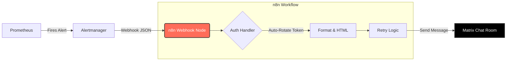

# 🚀 Prometheus to Matrix: Enterprise Alert Bridge


> A resilient, self-healing integration that formats **Prometheus Alertmanager** payloads into rich HTML messages and delivers them to **Matrix/Element** chat rooms.

---

## 📖 Overview

Standard webhooks often fail silently when tokens expire or networks hiccup. This workflow is designed with **DevOps reliability principles** in mind. It acts as a middleware between Alertmanager and Matrix, ensuring that critical infrastructure alerts are delivered, formatted beautifully, and securely authenticated.
### 🏗️ Architecture


### ✨ Key Features

* **🔐 Smart Authentication:** Implements a "Check-Verify-Renew" cycle. It caches access tokens in an internal database to prevent login spam, validates them before use (`whoami`), and automatically rotates them if expired (Self-Healing).
* **🎨 Rich HTML Formatting:** Parses raw Prometheus JSON (Labels & Annotations) into clean, readable HTML alerts with color-coded headers (🔴 Firing / 🟢 Resolved).
* **🛡️ Reliability First:** Includes **Exponential Backoff** and Jittered Retry logic for both the Login process and Message Delivery to handle network blips or Matrix server rate limits (HTTP 429).
* **🔗 Deep Linking:** Automatically generates links back to the specific graph in Prometheus for faster debugging.

---

## 🛠️ Prerequisites

* **n8n:** Version 1.0 or higher (Self-hosted or Cloud).
* **Matrix Account:** A dedicated user for the bot (e.g., `@prometheus:yourserver.com`).
* **Prometheus Alertmanager:** Configured to send webhooks to this n8n workflow.

---

## ⚙️ Setup Guide

### 1. Database Setup (Crucial Step)
This workflow uses n8n's internal **local binary data** (Variables/Tables) to store the authentication token.

1.  Go to your n8n dashboard and open the **Variables** (or Tables) section.
2.  Create a new Table named: `PrometheusAccessToken`
3.  Add the following two columns (case-sensitive):

| Column Name | Type | Description |
| :--- | :--- | :--- |
| `user_id` | Text | The Matrix User ID (Primary Key logic) |
| `access_token` | Text | The current active session token |

### 2. Import the Workflow
1.  Download the `Prometheus Alerts to Matrix.json` file from this repository.
2.  In n8n, click **"Import from File"** and select the JSON.

### 3. Configuration
You need to update the nodes with your specific server details.

* **Step: Login and get access token**
    * Update `URL`: `https://<YOUR_MATRIX_SERVER>/_matrix/client/v3/login`
    * Update JSON Body: Set your Bot's `user` and `password`.
* **Step: Get/Store Access Token**
    * Update the value in the filter to match your bot's User ID (e.g., `@prometheus:yourserver.com`).
* **Step: Set Config**
    * Update `room_id`: The internal Matrix Room ID (starts with `!`) where alerts should be sent.
* **Step: Send Alert**
    * Update `URL`: Replace the base domain with your Matrix homeserver URL.

---

## 📡 Alertmanager Configuration

Add this receiver to your `alertmanager.yml`:

```yaml
receivers:
- name: 'n8n-matrix-webhook'
  webhook_configs:
  - url: '[https://n8n.yourdomain.com/webhook/prometheus-alerts](https://n8n.yourdomain.com/webhook/prometheus-alerts)'
    send_resolved: true
```
---
## 📸 Screenshots
<div align="center">


</div>

---

<div align="center">
👨‍💻 Author
Ilia Shakeri

DevOps Engineer & Automation Enthusiast

Made with ❤️ using n8n
</div>
